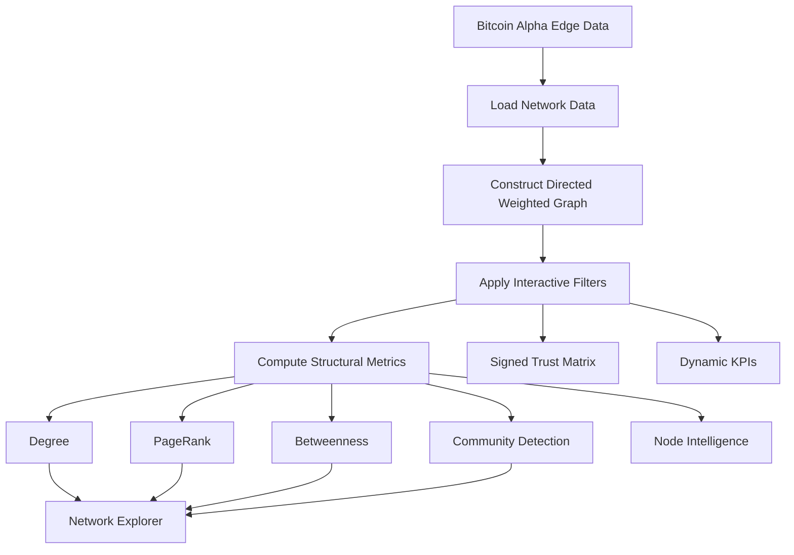

<div align="center">

# ₿ Bitcoin Trust Network Intelligence

### Interactive Signed-Network Analytics

Explore **trust, distrust, communities, centrality, and structural patterns** in the Stanford Bitcoin Alpha network.

[](https://bitcoin-trust-network-analytics.streamlit.app/)
[](https://github.com/nazishatta/bitcoin-trust-network-analytics)


**[🚀 Launch App](https://bitcoin-trust-network-analytics.streamlit.app/)** ·
**[💻 Source Code](https://github.com/nazishatta/bitcoin-trust-network-analytics)**

</div>

---

## 🔎 Project Overview

**Bitcoin Trust Network Intelligence** is an interactive Streamlit application for exploring the **Stanford Bitcoin Alpha signed trust network**.

The network is modeled as a **directed, weighted, signed graph**:

- **Nodes** represent anonymous Bitcoin Alpha users.
- **Directed edges** represent ratings issued from one user to another.
- **Positive ratings** represent trust.
- **Negative ratings** represent distrust.
- **Rating magnitude** represents relationship strength.

Instead of presenting one fixed network diagram, the application lets users interactively change the network view and examine how the structural story changes.

> **Core question:** How does the structure of a peer-to-peer trust network change when we examine different definitions of importance, relationship sentiment, communities, and connectivity thresholds?

---

## ✨ Key Features

| Feature | What it provides |
| :--- | :--- |
| 🕸️ **Network Explorer** | Interactive node-link visualization of the filtered network |
| 🎯 **Centrality Selector** | Switch node size between Degree, PageRank, and Betweenness |
| 🧩 **Community Detection** | Community membership encoded with categorical node color |
| 🔴 **Signed Relationships** | Explore all edges, trust only, or distrust only |
| 🧱 **Trust Matrix** | Signed adjacency-matrix alternative for dense network structure |
| 🧠 **Node Intelligence** | Centrality table plus Top-15 ranking visualization |
| 🎛️ **Interactive Filtering** | Degree, rating strength, node count, labels, and sentiment controls |
| 🔄 **Layout Comparison** | Compare force-directed and circular network layouts |
| 📊 **Dynamic KPIs** | Active nodes, visible edges, communities, and dataset distrust |
| ⚠️ **Interpretation Guidance** | Explicit methodology and visualization limitations |

---

## 🚀 Live Dashboard

### **[Open Bitcoin Trust Network Intelligence →](https://bitcoin-trust-network-analytics.streamlit.app/)**

The application is deployed on **Streamlit Community Cloud**.

Use the sidebar controls to change the active network and compare how different structural choices affect the visualization.

---

## 🎛️ Interactive Controls

| Control | Changes | Analytical purpose |
| :--- | :--- | :--- |
| **Layout** | Force-directed / Circular | Compare alternative spatial organizations |
| **Node size** | Degree / PageRank / Betweenness | Compare definitions of structural importance |
| **Edge sentiment** | All / Trust only / Distrust only | Isolate positive or negative relationships |
| **Minimum degree** | Node connectivity threshold | Reduce weakly connected nodes |
| **Minimum edge strength** | Minimum `|rating|` | Focus on stronger relationships |
| **Maximum displayed nodes** | Visible network size | Control density and readability |
| **Show node labels** | Node-ID visibility | Balance annotation and visual clutter |

> Filtering changes the graph being displayed. The active controls are therefore part of the analytical interpretation, not merely cosmetic settings.

---

## 🕸️ Network Explorer

The primary view is an interactive **node-link diagram**.

### Visual Encoding

| Visual channel | Encoded network property |
| :--- | :--- |
| **Node** | Bitcoin Alpha user |
| **Directed edge** | Rating from one user to another |
| **Node size** | Selected centrality measure |
| **Node color** | Detected community |
| **Edge sign / appearance** | Trust versus distrust |
| **Edge magnitude** | Rating strength |
| **Position** | Algorithmic network layout |

### Why multiple centrality measures?

**Degree** measures connectivity.

**Betweenness centrality** identifies nodes that frequently lie on shortest paths and may function as structural bridges.

**PageRank** measures recursive importance in a directed network, giving greater influence to links involving other important nodes.

The dashboard allows the same graph to be viewed through each measure rather than treating one definition of importance as universally correct.

---

## 🧩 Community Structure

Node color represents **detected community membership**.

Community detection adds a group-level structural perspective to the node-level centrality measures. It helps reveal clusters of users that are more strongly connected within the displayed network.

> Community color is **categorical**. It does not represent an ordered scale of importance or trustworthiness.

---

## 🔴 Trust vs. Distrust

Bitcoin Alpha is a **signed network**.

```text
Positive rating  →  Trust
Negative rating  →  Distrust
|Rating|         →  Relationship strength
```

The dashboard can display:

- **All** relationships
- **Trust only**
- **Distrust only**

The edge-strength threshold operates on absolute rating magnitude so users can focus on stronger relationships without discarding the distinction between positive and negative ratings.

---

## 🧱 Trust Matrix

The **Trust Matrix** provides an adjacency-matrix representation of the active network.

```text
Row     = Source node
Column  = Target node
Cell    = Signed trust rating
```

A diverging scale centered on zero separates negative and positive relationships.

### Why provide a second network view?

A node-link diagram is useful for seeing:

- hubs;
- paths;
- bridges;
- communities;
- topology.

An adjacency matrix is useful for seeing:

- relationship density;
- block structure;
- signed patterns;
- clusters of interactions;
- presence or absence of connections.

This alternative view becomes especially useful when a node-link graph begins to turn into a visual **hairball**.

---

## 🧠 Node Intelligence

The Node Intelligence view provides a quantitative companion to the network visualization.

The table includes:

| Metric | Interpretation |
| :--- | :--- |
| **Node** | Anonymous network identifier |
| **Degree** | Number of visible connections |
| **PageRank** | Recursive directed-network importance |
| **Betweenness** | Shortest-path bridging importance |
| **Community** | Detected structural group |

A **Top-15 horizontal ranking chart** responds to the selected structural metric.

This makes it possible to compare what looks visually prominent in the network with the computed centrality values.

---

## 📊 Dynamic Network KPIs

The application summarizes the active analytical state using headline metrics:

| KPI | Meaning |
| :--- | :--- |
| **Active nodes** | Nodes remaining after filtering |
| **Visible edges** | Directed relationships in the active graph |
| **Communities** | Detected groups represented in the current view |
| **Dataset distrust** | Negative-edge share in the underlying dataset |

The dataset-level distrust metric remains independent of the current edge-sentiment view, preventing a trust-only visualization from being mistaken for evidence that the original network contains no distrust.

---

## 🧹 Handling the Hairball Problem

Large network diagrams can become visually saturated and stop communicating useful structure.

The application addresses this through:

1. **Minimum-degree filtering**
2. **Minimum edge-strength filtering**
3. **Maximum displayed-node control**
4. **Trust/distrust filtering**
5. **Alternative adjacency-matrix representation**

The goal is not to hide network complexity. It is to make the trade-off between **completeness and readability** explicit and interactive.

---

## ⚠️ Interpretation & Limitations

### Layout is not measured distance

Force-directed position is generated algorithmically. Visual proximity should **not** be interpreted as physical, geographic, temporal, or directly observed distance.

### Filtering changes the visible network

Changing thresholds changes which nodes and edges remain. Structural patterns should therefore be interpreted together with the active filter settings.

### Centrality depends on the question

Degree, PageRank, and betweenness describe different forms of structural importance and can rank the same nodes differently.

### Community membership is categorical

Community colors identify detected groups. They do not imply higher or lower quality, importance, or trustworthiness.

### Dense node-link views have limits

As network density grows, overlapping nodes and edges can obscure structure. The matrix view provides an alternative representation for this reason.

### Association is not causation

The network records rating relationships. Its structure alone does not establish why one user trusted or distrusted another.

---

## 🗂️ Dataset

The project uses the **Stanford Bitcoin Alpha signed trust network**.

```text
data/soc-sign-bitcoinalpha.csv
```

Conceptually:

```text
Source user ── signed rating ──▶ Target user
```

The graph is constructed as a **directed weighted network**, preserving both rating direction and sign.

---

## 🧮 Analysis Pipeline



---

## 🛠️ Technology Stack

| Technology | Role |
| :--- | :--- |
| **Python** | Application and analytical logic |
| **Streamlit** | Interactive dashboard |
| **NetworkX** | Graph construction and structural analysis |
| **PyVis** | Interactive node-link rendering |
| **Plotly** | Matrix and analytical charts |
| **Pandas** | Data loading and transformation |
| **SciPy** | Numerical support for graph analytics |
| **Git / GitHub** | Version control and source hosting |
| **Streamlit Community Cloud** | Public deployment |

---

## 📁 Repository Structure

```text
bitcoin-trust-network-analytics/
│
├── app.py
├── requirements.txt
├── README.md
│
├── data/
│   └── soc-sign-bitcoinalpha.csv
│
└── src/
    ├── graph_metrics.py
    ├── network_renderer.py
    └── matrix_view.py
```

---

<details>
<summary><strong>💻 Run the Project Locally</strong></summary>

<br>

Clone the repository:

```bash
git clone https://github.com/nazishatta/bitcoin-trust-network-analytics.git
cd bitcoin-trust-network-analytics
```

Create a virtual environment:

```bash
python3 -m venv .venv
```

Activate it on macOS/Linux:

```bash
source .venv/bin/activate
```

Install dependencies:

```bash
python -m pip install -r requirements.txt
```

Run Streamlit:

```bash
python -m streamlit run app.py
```

Open:

```text
http://localhost:8501
```

</details>

---

<details>
<summary><strong>🧭 Suggested Interactive Exploration</strong></summary>

<br>

1. Begin with the default filtered network.
2. Switch **Node size** between Degree, PageRank, and Betweenness.
3. Compare **All**, **Trust only**, and **Distrust only**.
4. Increase the minimum-degree threshold.
5. Increase minimum edge strength to isolate stronger ratings.
6. Change the maximum displayed-node count and observe the readability trade-off.
7. Compare **force-directed** and **circular** layouts.
8. Open the **Trust Matrix** and compare its structure with the node-link view.
9. Open **Node Intelligence** and compare the centrality ranking with visually prominent nodes.

</details>

---

<details>
<summary><strong>🔬 Potential Extensions</strong></summary>

<br>

Future development could include:

- ego-network exploration;
- temporal trust evolution;
- centrality-threshold filtering;
- community-level statistics;
- trust/distrust ratios by community;
- additional layouts;
- signed-network-specific structural measures;
- shortest-path exploration;
- temporal animation;
- structural anomaly analysis.

These are potential extensions rather than features claimed by the current application.

</details>

---

## 👤 Author

<div align="center">

### **Nazish Atta**

**M.S. Data Science · George Washington University**

Data Science · Analytics · Machine Learning · Interactive Visualization

[](https://github.com/nazishatta)
[](https://github.com/nazishatta/bitcoin-trust-network-analytics)
[](https://bitcoin-trust-network-analytics.streamlit.app/)

---

### ₿ Explore the Network

**Change the filters. Compare centrality measures. Separate trust from distrust. Inspect communities. See how the network story changes.**

### **[🚀 Launch Bitcoin Trust Network Intelligence](https://bitcoin-trust-network-analytics.streamlit.app/)**

</div>
